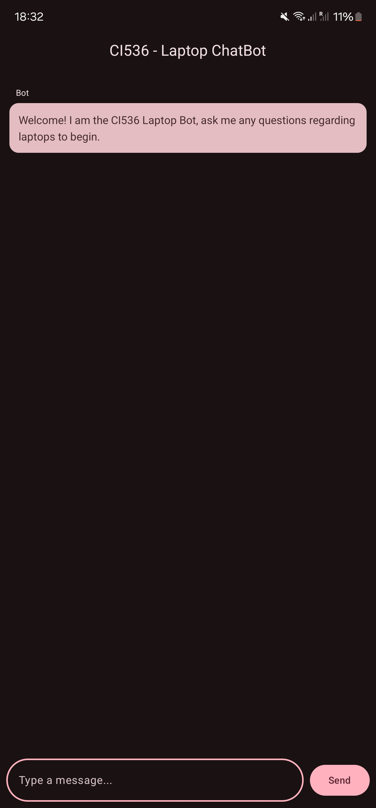

# CI536 - Integrated Group Project

## Laptop ChatBot App

### 📖 About
The Laptop ChatBot App is an Android application designed for Android 14+ devices. It connects to the **CI536 ChatBot Server**, allowing users to send and receive inquiries about laptops from an AI-powered model running on the server.

---

## 📋 Requirements
- **Android Studio** (2024.2.1 or later)
- **Android 14+** device or emulator

---

## 🛠 Building in Android Studio
Follow these steps to set up and run the project:

1. **Clone the repository**
    - Open **Android Studio**
    - Navigate to `File` → `New` → `Project from Version Control`
    - Enter the repository URL
    - Click **Clone**

2. **Connect a Device**
    - Use an **Android 14+** physical device or set up an **emulator**

3. **Build & Run**
    - Click the **Play button** in the top right of Android Studio

---

## 📸 Screenshots

    
    
    

---

## 📜 License
This project is licensed under the **MIT License**. See [LICENSE](LICENSE) for more details.

---

## 💡 Contributors
- **Nathan** (@Lunarixus)
---

